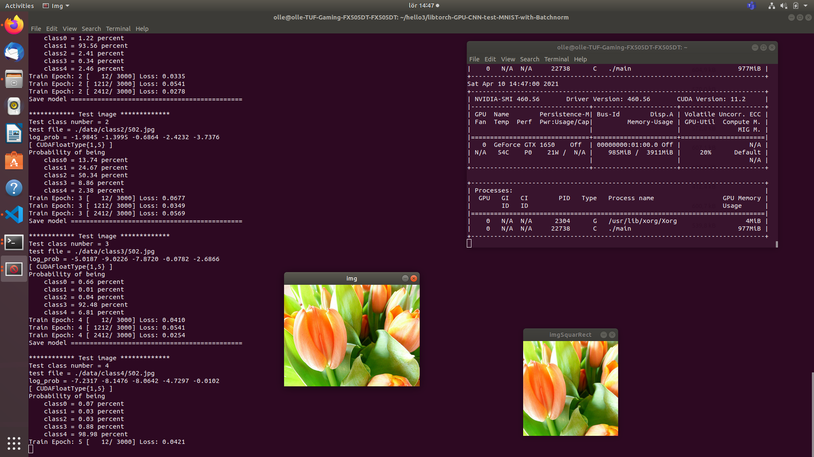
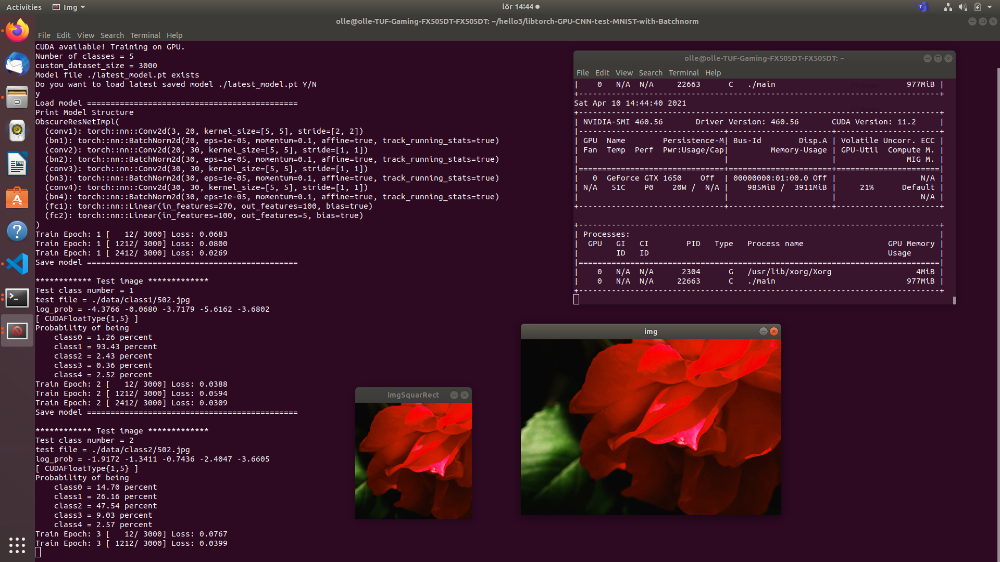

# PyTorch C++ API test a small convolution neural network on Kaggle Flowers datasets.

Train and Test a Deep neural network with PyTorch C++ API Libtorch on 5 classes of flowers get from Kaggle Flowers dataset.

## Installation guide on Ubuntu machine:

#### Directly installation:

https://github.com/ollewelin/torchlib-opencv-gpu

#### Or use Anaconda enviroment:

https://github.com/ollewelin/Installing-and-Test-PyTorch-C-API-on-Ubuntu-with-GPU-enabled

## Download and build this repository:

### Get this repo

    $ mkdir class_test
    $ cd class_test
    $ git clone https://github.com/ollewelin/5_classes_PyTorch_test
    $ cd 5_classes_PyTorch_test
    
### Open in Visual Code

    $ code .

### Change CMakeLists.txt to fit your path

    list(APPEND CMAKE_PREFIX_PATH "/home/olle/class_test/5_classes_PyTorch_test/libtorch")

## Make a dataset with 5 categories 

### Download flowers datasets from kaggle

https://www.kaggle.com/alxmamaev/flowers-recognition

### Make 5 data folders with 503 jpg files abriatary size images

#### Data structure

    repo_root 
    
    CMakeLists.txt
    file_names.csv
    main.cpp
    model.h
    
    repo_root/libtorch
    
    repo_root/data
    repo_root/data/class0/0..502.jpg files
    repo_root/data/class1/0..502.jpg files
    repo_root/data/class2/0..502.jpg files
    repo_root/data/class3/0..502.jpg files
    repo_root/data/class4/0..502.jpg files
    
#### Make datasets structure 
    
    $ mkdir data
    $ cd data
    
#### Copy over 5 categorys flowers from Kaggle dataset into data

Rename each flower catalogue to class0..5

Auto rename all jpg files inside each folder to be 0.jpg to 502.jpg etc

    $ cd class0
    $ counter=0; for file in *; do [[ -f $file ]] && mv -i "$file" $((counter+1)).jpg && ((counter++)); done
    $ cd ..
    $ cd class1
    $ counter=0; for file in *; do [[ -f $file ]] && mv -i "$file" $((counter+1)).jpg && ((counter++)); done
    $ cd ..
    $ cd class2
    $ counter=0; for file in *; do [[ -f $file ]] && mv -i "$file" $((counter+1)).jpg && ((counter++)); done
    $ cd ..
    $ cd class3
    $ counter=0; for file in *; do [[ -f $file ]] && mv -i "$file" $((counter+1)).jpg && ((counter++)); done
    $ cd ..
    $ cd class4
    $ counter=0; for file in *; do [[ -f $file ]] && mv -i "$file" $((counter+1)).jpg && ((counter++)); done
    $ cd ..
  

### Build and Run the program

    $ cmake CMakeLists.txt
    $ make 
    $ ./main
    
